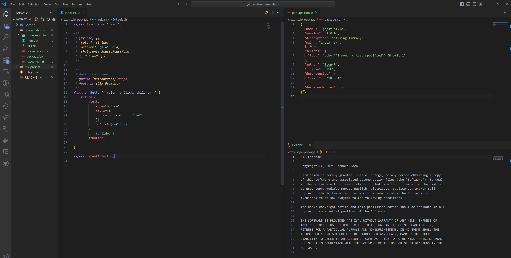
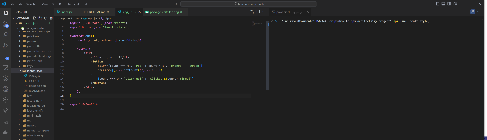
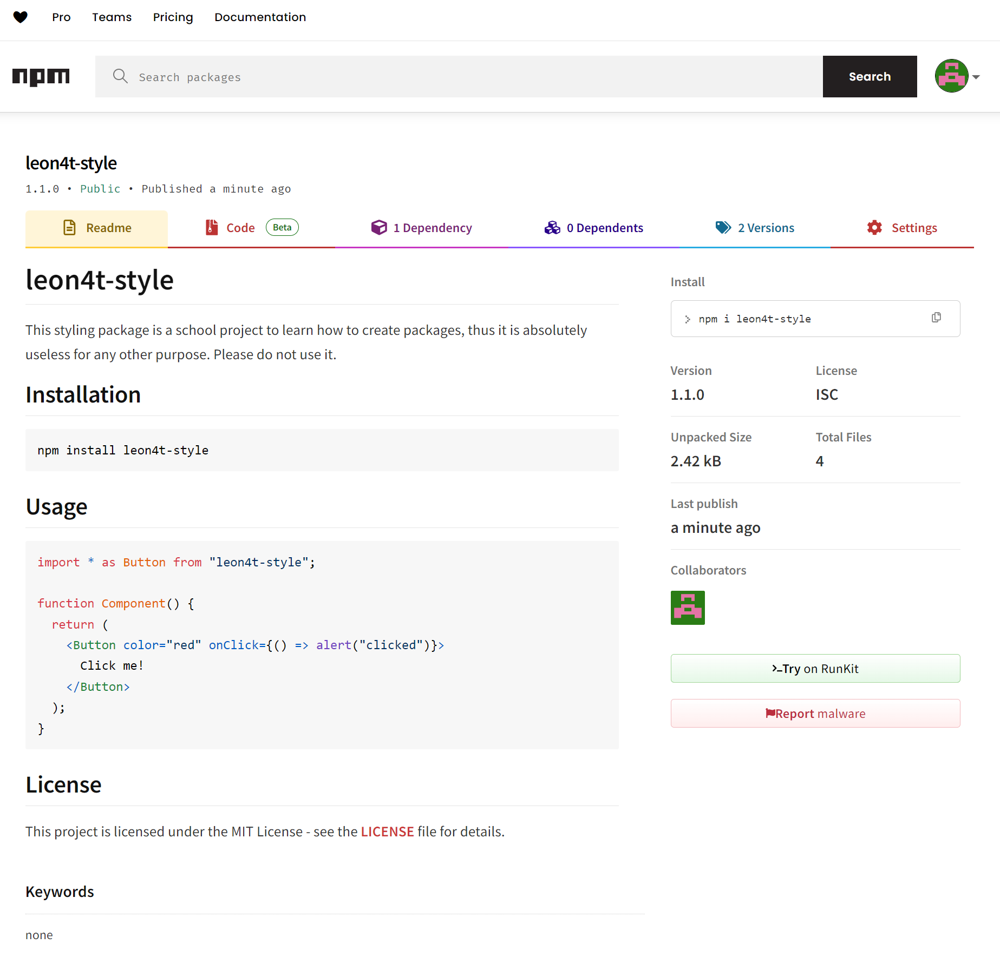
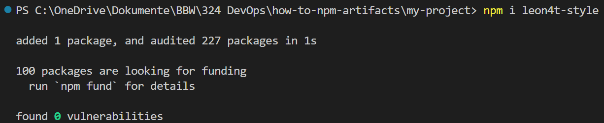
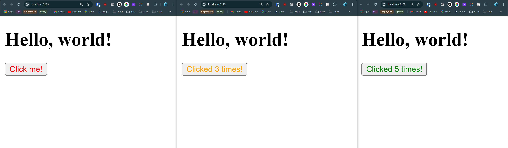

# How to npm packages

Dieses Repository dient zur Ergebnissicherung der Augaben _JS Artifakte_ aus dem Modul DevOps 324.

## 1. Package erstellen



## 2. Package lokal veröffentlichen (Optional)

```bash
npm link # im root-Verzeichnis des Projekts
```

## 3. Lokal veröffentlichtes Package testen



## 4. Package veröffentlichen

```bash
npm login
npm publish
```



## 5. Package installieren

```bash
npm install leon4t-style
```



## 6. Package verwenden


